# 数据安全

操作界面示例截图（按步骤依次操作）

### 安全级别
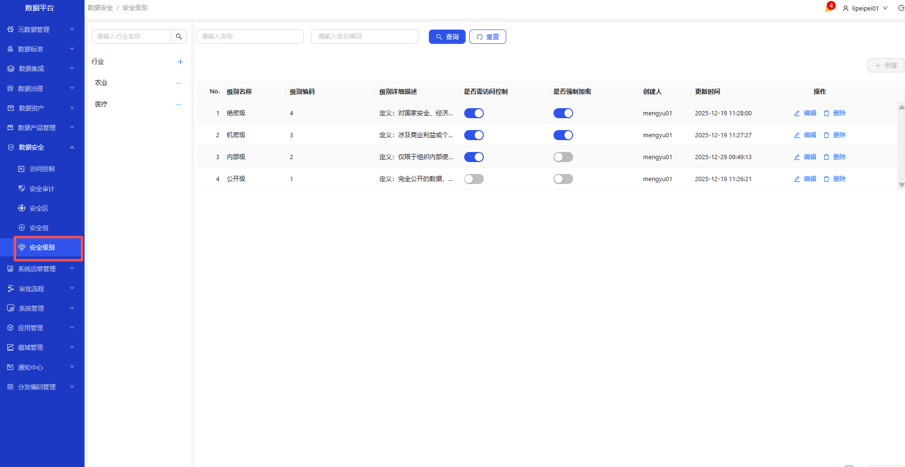
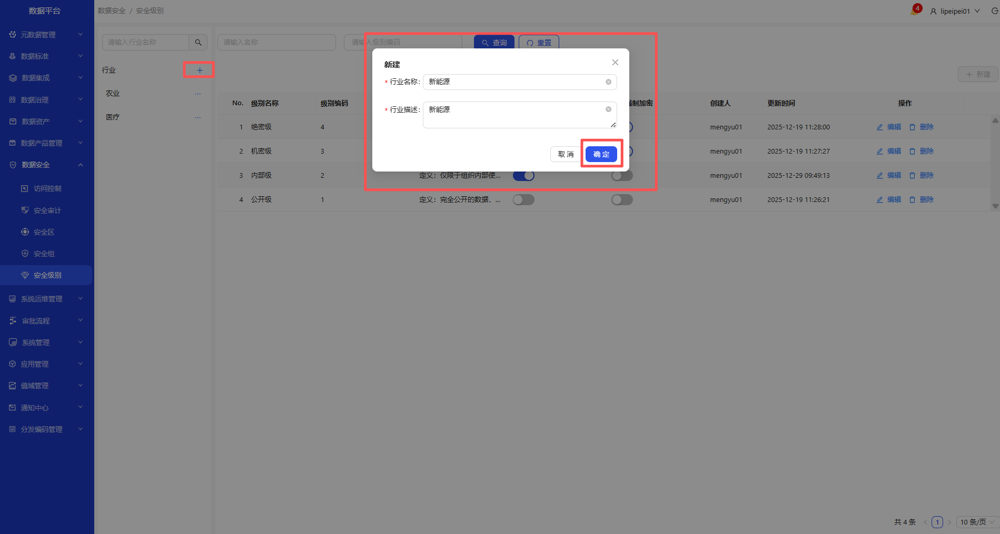
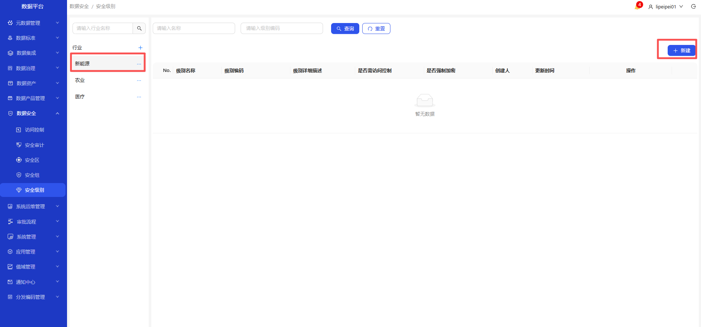
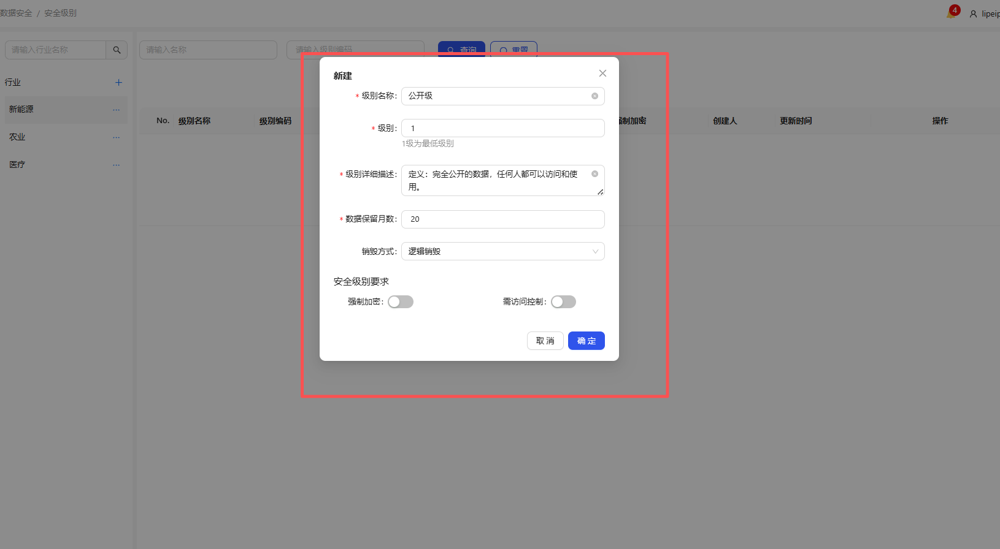
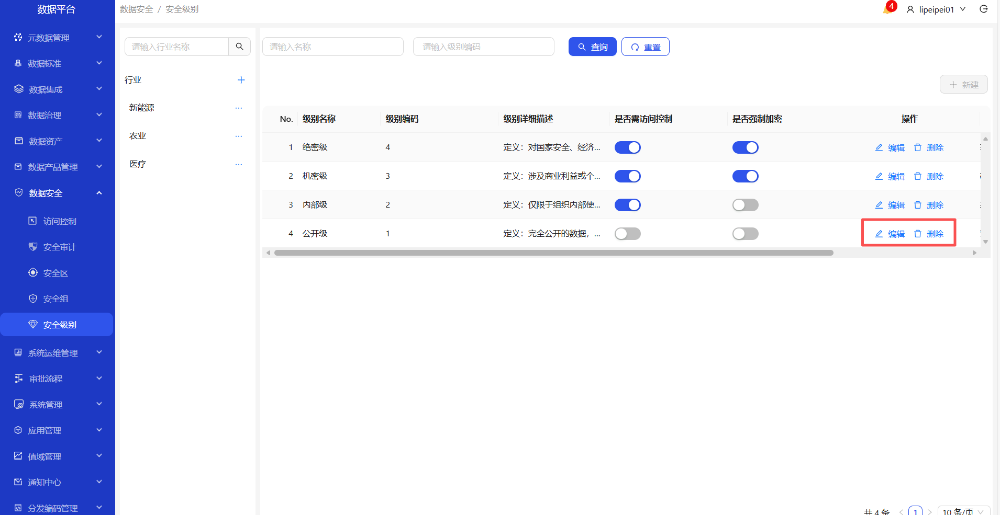

1. 进入数据安全-安全级别页面
2. 点击+，新建行业，输入行业名称和行业描述后，点击确定
3. 选中新建的行业，点击新建按钮
4. 填写完成的数据后点击确定按钮，成功新建安全级别
5. 已有的安全级别可编辑和删除

### 安全组
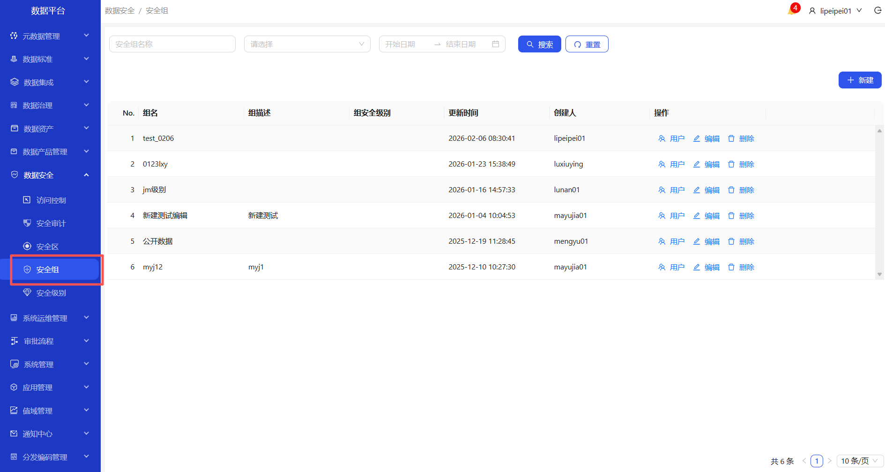
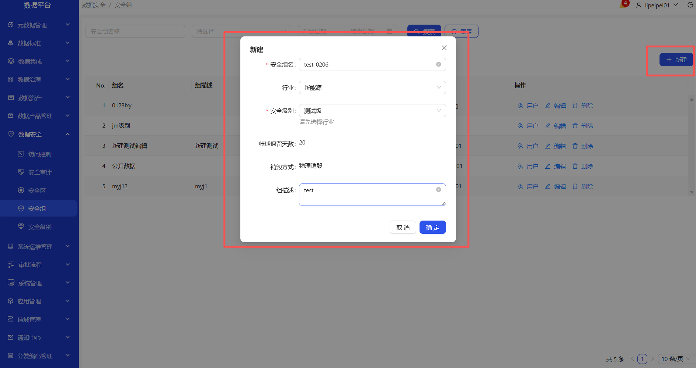
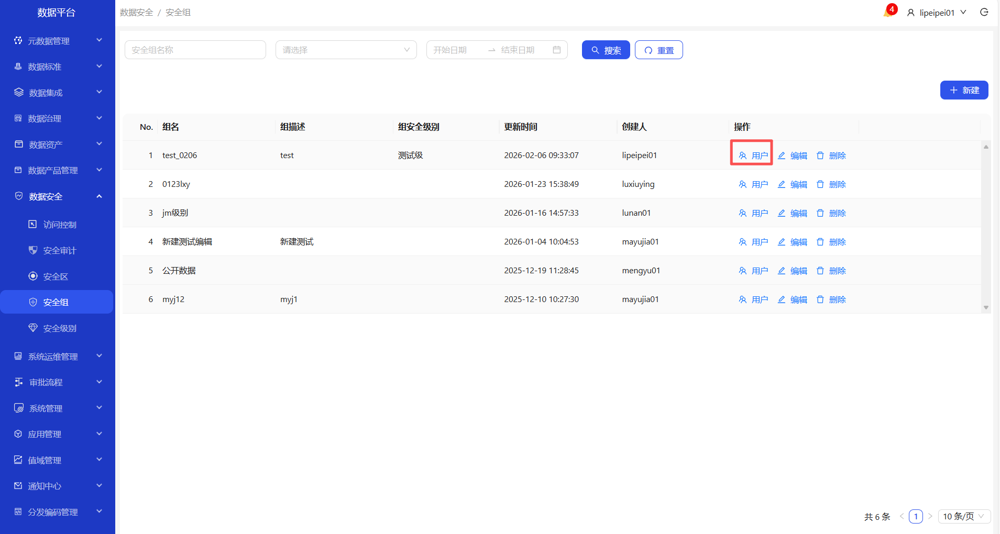
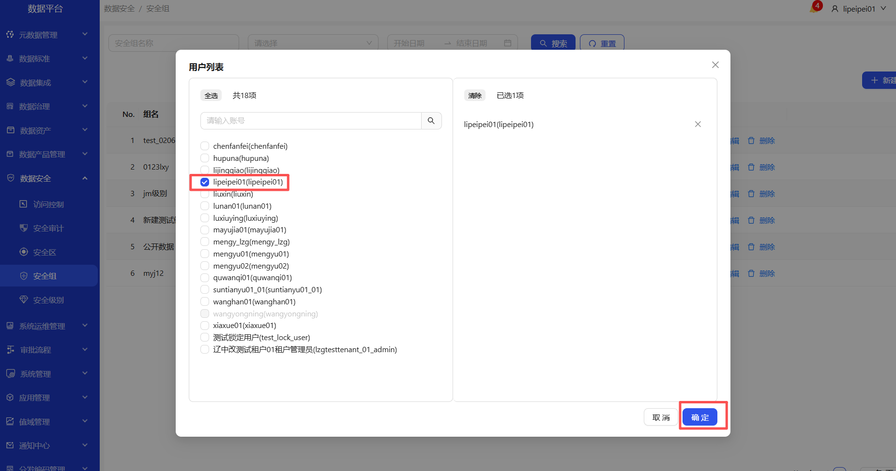
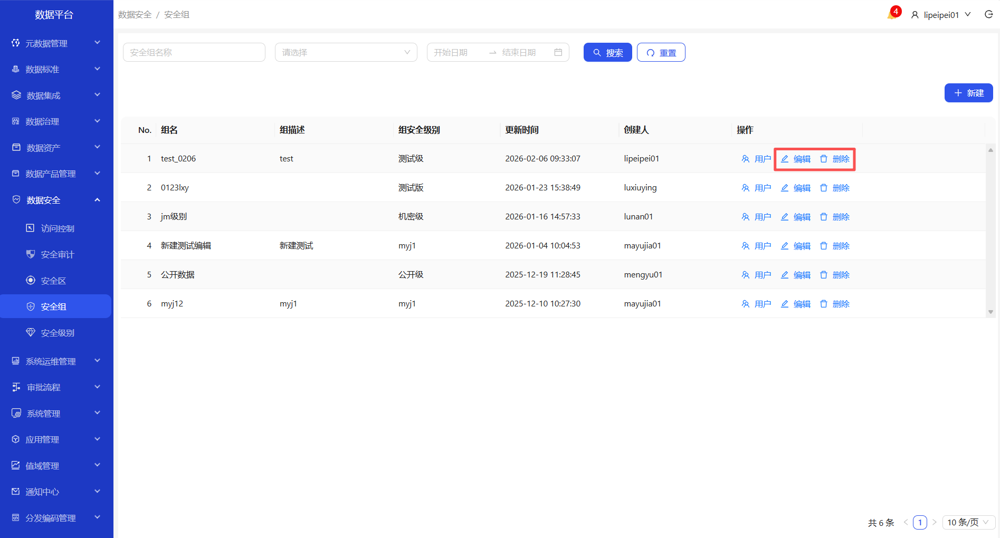

1. 进入数据安全-安全组页面
2. 点击新建，填写完成的数据，点击确定按钮，成功新建安全组
3. 操作列，点击用户可进行配置

### 访问控制
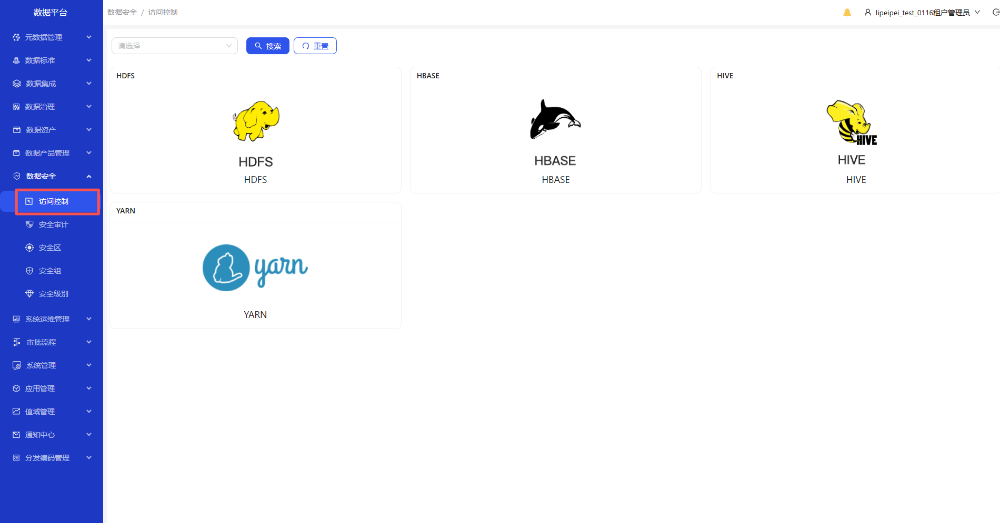

1. 进入数据安全-访问控制页面
2. 

### 安全审计

### 安全区

