# 系统运维管理

操作流程总览图

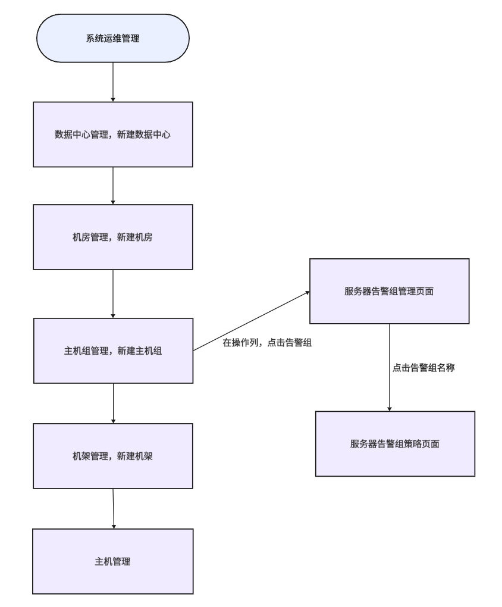

操作界面示例截图（按步骤依次操作）

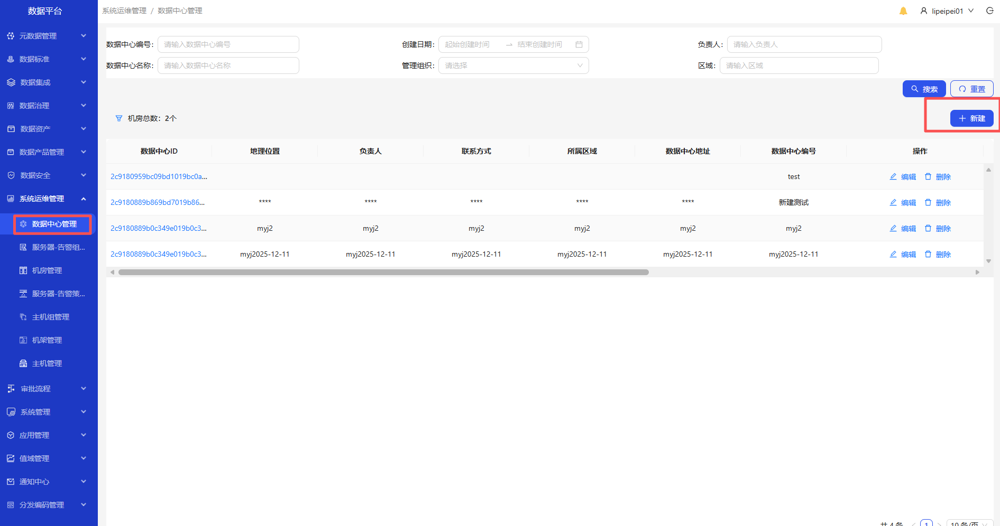
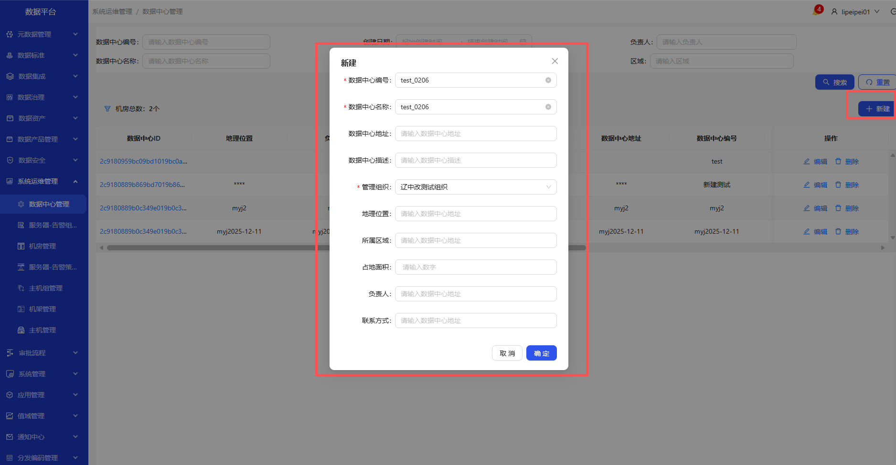
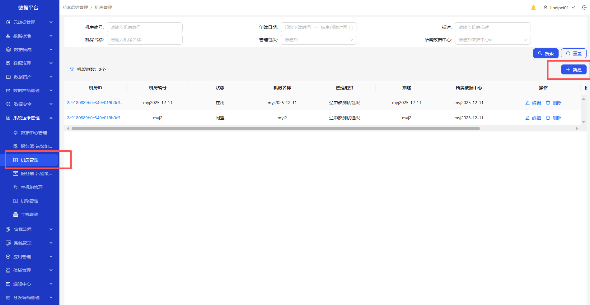
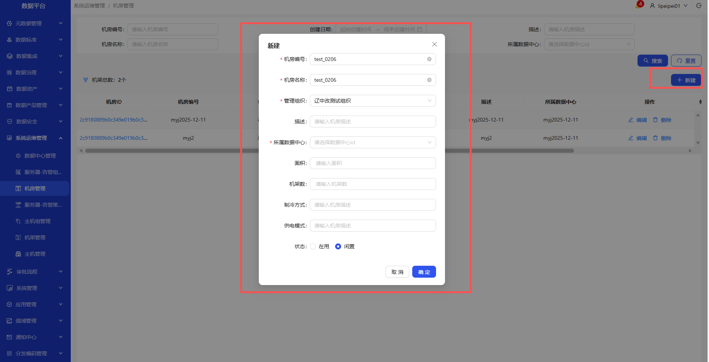
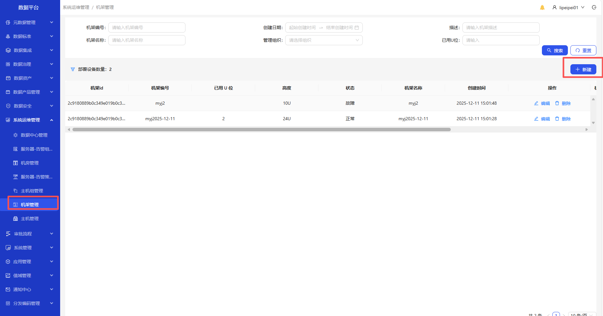
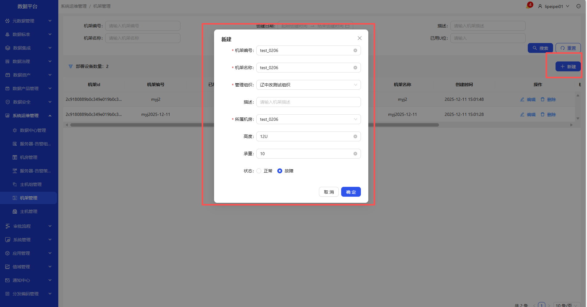
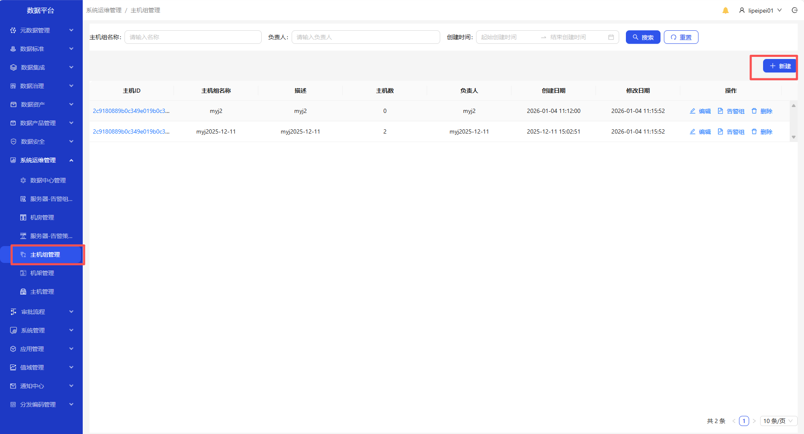
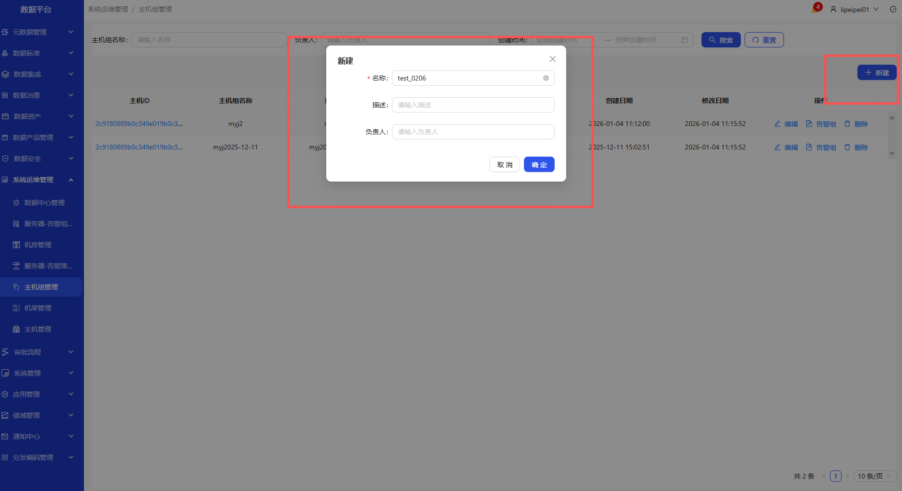
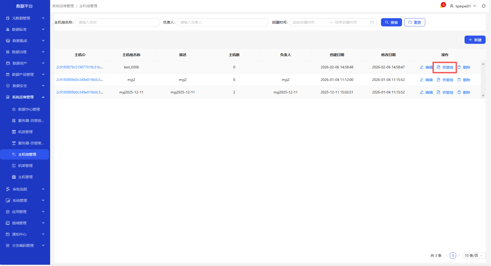
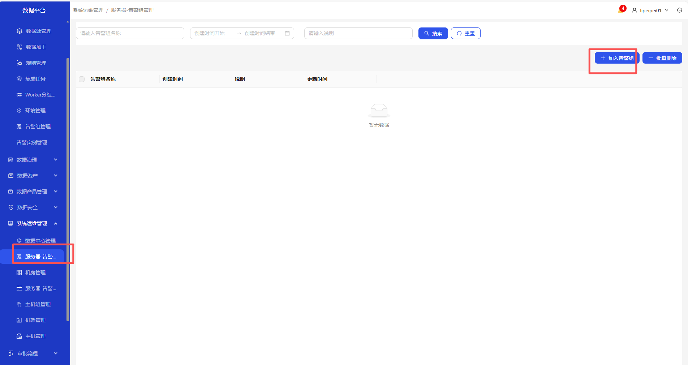
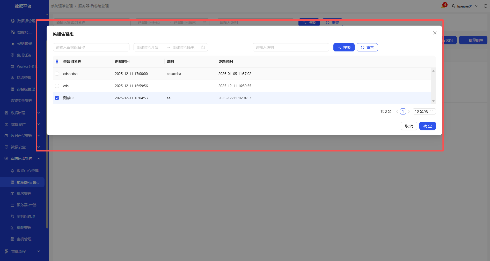
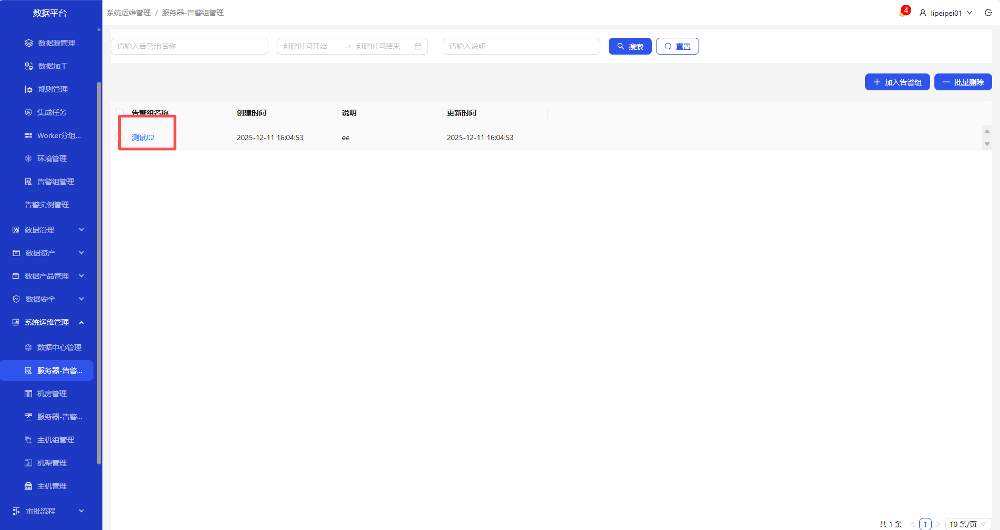
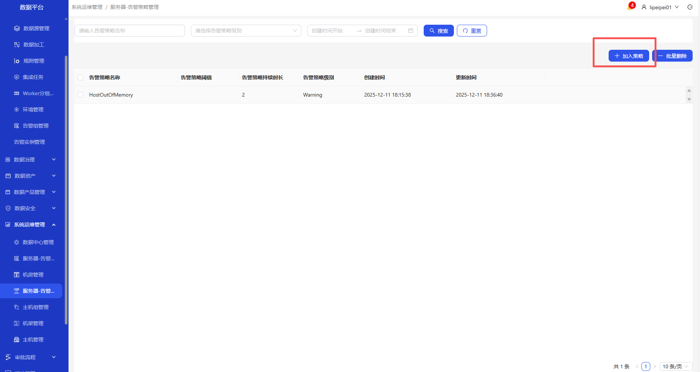
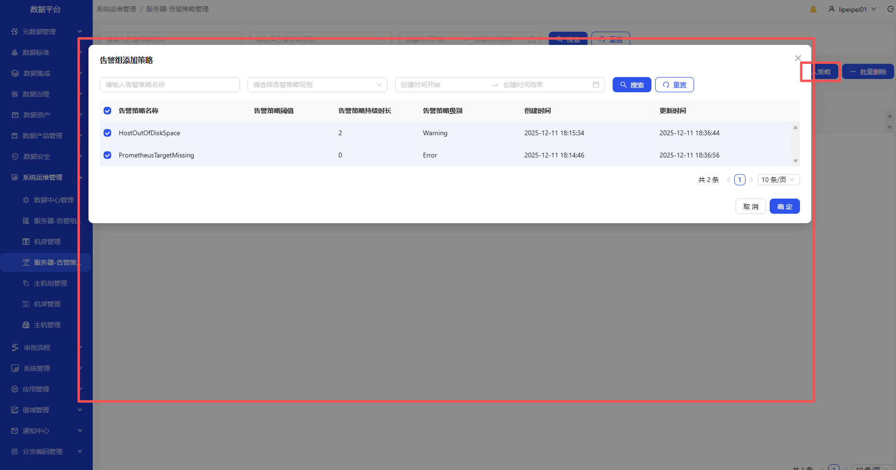
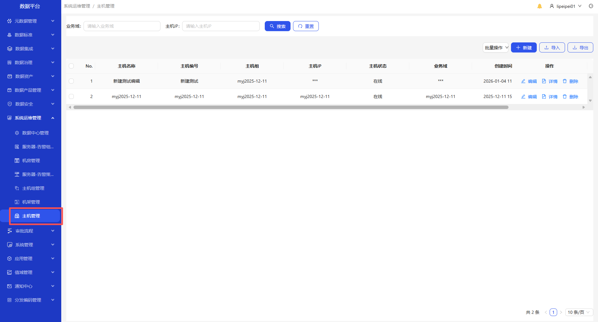
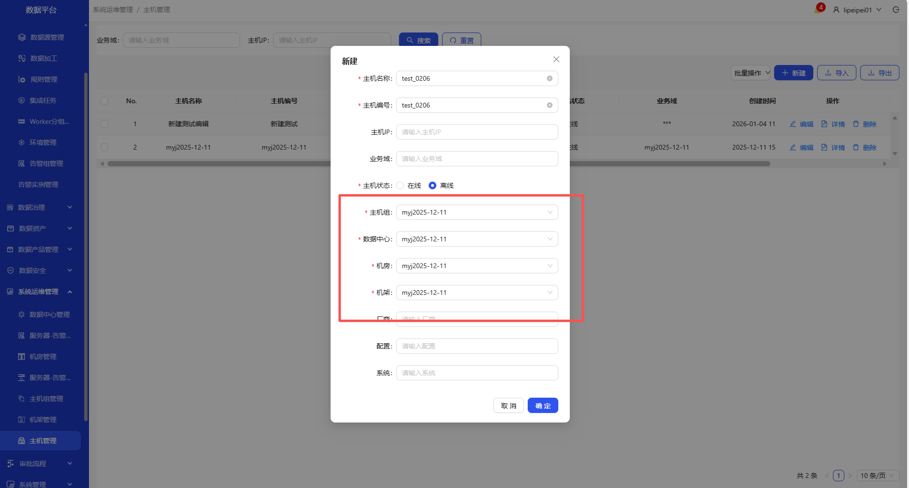

1. 进入系统运维管理-数据中心管理页面，新建数据中心，可进行编辑、删除
2. 进入系统运维管理-机房管理页面，新建机房，可进行编辑、删除
3. 进入系统运维管理-机架管理页面，新建机架，可进行编辑、删除
4. 进入系统运维管理-主机组管理页面，新建主机组，可进行编辑、删除
5. 进入系统运维管理-主机组管理页面，在操作列，点击告警组，进入服务器-告警组管理页面,点击添加到告警组
6. 进入系统运维管理-服务器-告警组管理页面，点击告警组名称，进入服务器-告警策略管理，点击加入策略
7. 进入系统运维管理-主机管理页面，点击新建按钮，选择已建的数据中心、机房、机架、主机组新建主机。新建的主机可编辑、删除、查看详情